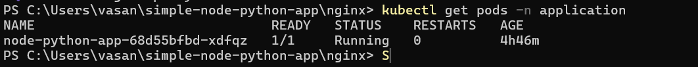
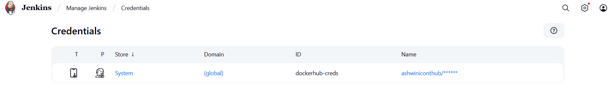
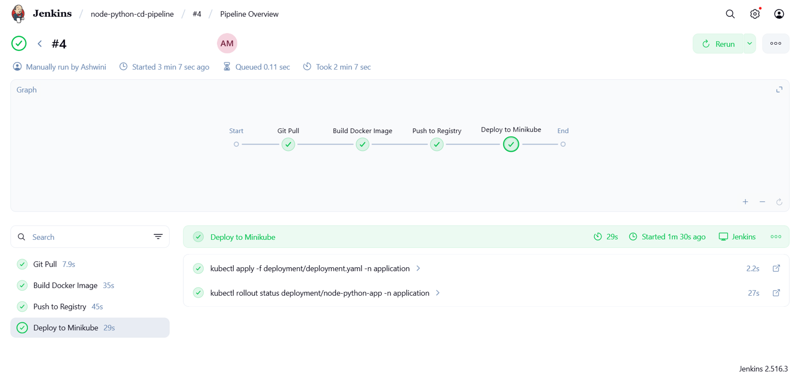
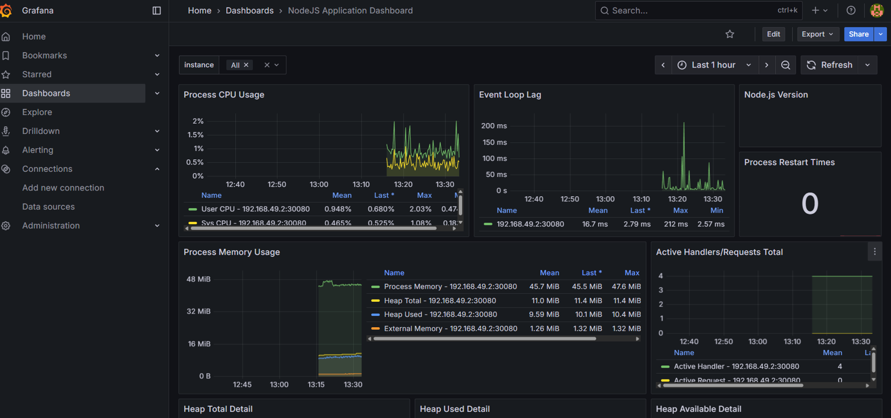
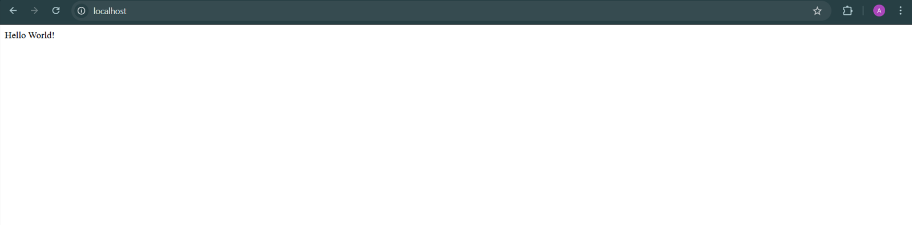

# Fresher DevOps Assignment

This repository contains my complete solution for the **Fresher DevOps Assignment**, covering Kubernetes architecture, CI/CD with Jenkins, Observability with Prometheus & Grafana, and Nginx reverse proxy setup.

---

## Overview

This project demonstrates practical knowledge of DevOps tools and workflows using:
- **Kubernetes (Minikube)** for container orchestration  
- **Jenkins** for CI/CD pipeline  
- **Prometheus & Grafana** for observability and monitoring  
- **Nginx** as a reverse proxy for web app routing  

Each part simulates a real-world scenario and is implemented step-by-step.

---

## Task 1: Kubernetes Architecture

### Project Description
- Explained the **Kubernetes architecture** with all major components:
  - **Master Node**: API Server, Controller Manager, Scheduler, etcd  
  - **Worker Node**: kubelet, kube-proxy, container runtime  
- Described how **Pods, Services, Deployments, and Namespaces** interact.


### Deliverables
- [k8s_architecture.pdf](k8s_architecture.pdf) – Explanation document 
- [K8s_architecture_diagram.png](K8s_architecture_diagram.png) – Architecture diagram  

### Tools Used
- Draw.io for architecture diagram  
- Overleaf for Documentation
---

## Task 2: CI/CD Pipeline with Jenkins

### Project Description
- This part automates the deployment of a **Python + Node.js** application into a **Kubernetes cluster** using a **Jenkins pipeline**.  
- The Jenkins server runs as a container, builds and pushes Docker images to Docker Hub, and then deploys them on Minikube.

### Files used
* [deployment](deployment)
* [Groovy](jenkins/pipeline.groovy)


### How to run this application on minikube and automate the deployment with Jenkins. 

#### Prerequisites

Ensure the following tools are installed on your system:

  | Tool | Purpose | Command to Check |
  |------|----------|-----------------|
  | **Docker Desktop** | Container runtime | `docker --version` |
  | **Minikube** | Local Kubernetes cluster | `minikube version` |
  | **Kubectl** | Kubernetes CLI | `kubectl version --client` |
  | **Git** | Version control | `git --version` |
  | **Jenkins** | CI/CD automation server | `docker ps` |

✅ **Tip:** Open **Docker Desktop** and ensure it is **running** before proceeding.

#### Steps for deployment and automation.

* Create a minikube cluster and ensure the cluster is created by running the below commands.
  ```bash
  minikube start --driver=docker 
  minikube status
  ```
* Apply the deployment files available in  [here](deployment).
  ```bash
  kubectl apply -f ./deployment
  ```
* Ensure the pods are running and service can reachable.

  
* To enable automation install jenkins in docker using below command.
  ```bash
  docker run -d --name jenkins `
    -u root `
    -p 8080:8080 -p 50000:50000 `
    -v jenkins_home:/var/jenkins_home `
    -v //var/run/docker.sock:/var/run/docker.sock `
    -v C:\Users\{Username}\.kube:/root/.kube:ro `
    -v C:\Users\{Username}\.minikube:/root/.minikube `
    ashwiniconthub/jenkins:version1.0
  ```
* Once installed configure pipeline with the groovy script available [here](jenkins/pipeline.groovy).
  
* Ensure the docker hub credentials are available in jenkins to push the imaged to docker hub.

  
* build the pipeline and ensure the pipeline complete the below stages.


### Complications 

* Issue: Jenkins container couldn’t access Minikube’s kubeconfig

    Fix: Mounted host .kube folder into Jenkins container
* Issue: Permission errors when running kubectl inside Jenkins

     Fix: Used jenkins container with -u root and mounted docker.sock

## Task 3: Observability with Prometheus & Grafana

### Project Description

Deployed a Python app on minikube, configured Prometheus to scrape metrics, and visualized data using Grafana.

### Files used
* [prometheus.yml](prometheus/prometheus.yml)
* [dashboard.json](grafana/dashboard.json)


### Steps
* I have a metrics endpoint that provides my application metrics.

* Create a `prometheus.yml` file to scrape the application metrics.  
  You can find the file [here](prometheus/prometheus.yml).

* To add these metrics to Prometheus, install Prometheus using the following Docker command:

  ```bash
  docker run -d --name prometheus -p 9090:9090
  --network=minikube 
  -v C:/Users/{username}/simple-node-python-app/prometheus:/etc/prometheus prom/prometheus
  ```
* Make sure the attached volume location contains the `prometheus.yml` file.

* Access Prometheus at [http://localhost:9090](http://localhost:9090) and ensure that the targets are properly configured.

* Install Grafana by running the following command:
  ```bash
  docker run -d --name grafana --network=minikube -p 3000:3000 grafana/grafana
  ```
* Access the grafana in http://localhost:3000.
* Add the prometheus as datasource.
* Create a dashboard with the dashboard.json file availale [here](grafana/dashboard.json).
* Access dashboard and monitor application.


### Complication 

* Heroku Hosting Issue – Created an account but found Heroku not fully open source and required card verification, so I hosted Prometheus and Grafana locally instead.

* Prometheus Metrics Inaccessible – Metrics couldn’t be accessed even with correct scrape config because Prometheus and Minikube were on different networks.

  Fix: Ran Prometheus on the same network as Minikube using --network minikube.

* Grafana Data Source Issue – Unable to add Prometheus as a data source due to network difference.

  Fix: Used host.docker.internal:9090 instead of localhost:9090

## Task 4: Nginx Reverse Proxy
### Project Description
Configured Nginx as a reverse proxy to forward traffic to the Python app.
### Files used
* [nginx.conf](nginx/nginx.conf)
* [Dockerfile](nginx/Dockerfile)
* [Docker-compose.yaml](nginx/docker-compose.yaml)

### Steps
* Created an Nginx configuration file to reverse proxy my application to port 80 [nginx.conf](nginx/nginx.conf).

* Built a Docker image by replacing the default Nginx config file with the newly created one [Dockerfile](nginx/Dockerfile) .

* Prepared a Docker Compose file to deploy both the application and Nginx in the same network  [Docker-compose.yaml](nginx/docker-compose.yaml) 

* Applied the Docker Compose file using the command below:
  ```bash
  docker compose up -d
  ```

* Finally, I was able to access my application via localhost, successfully reverse proxied through Nginx.


### Complication 
* Port Conflict Issue – The port 3000 was already in use by Jenkins, which caused a conflict with my Node.js app.

  Fix: Updated the application port to 3030 in the Docker Compose file, which resolved the issue.


 


  
